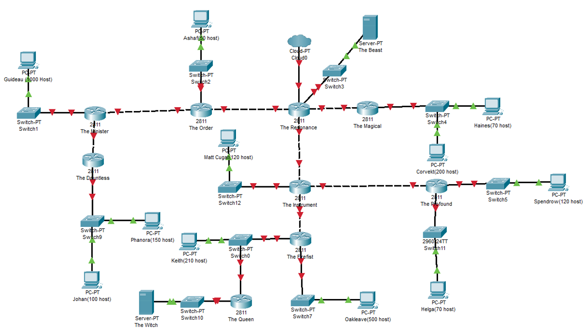
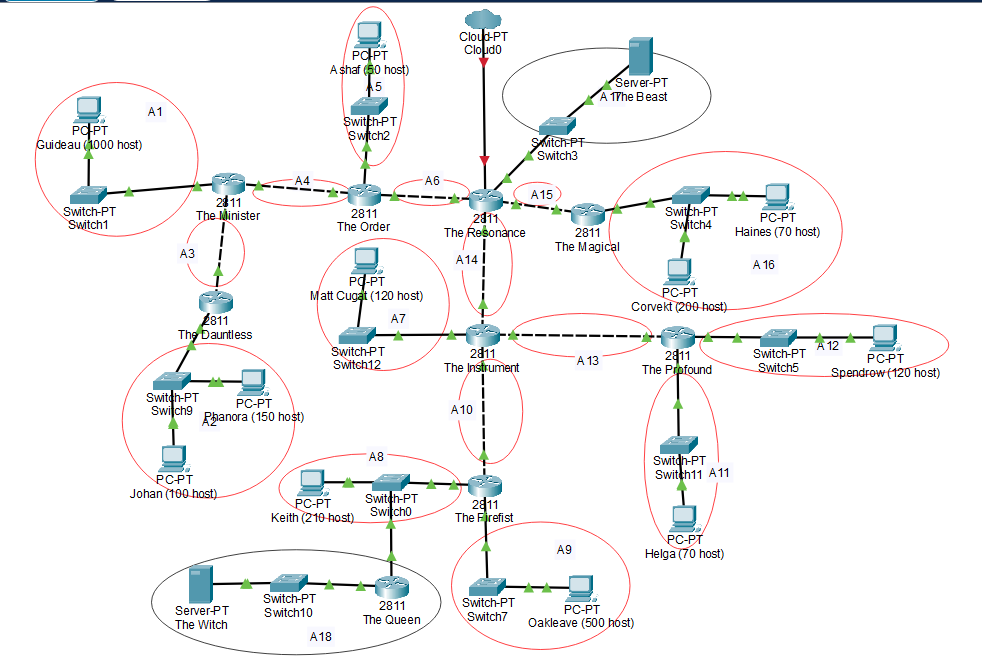
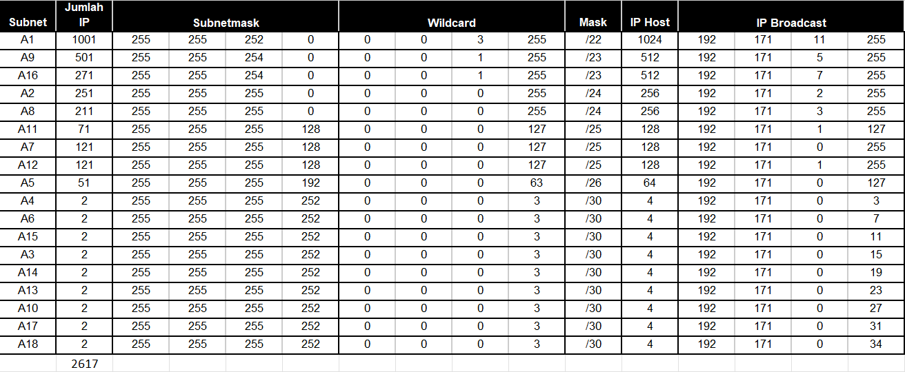
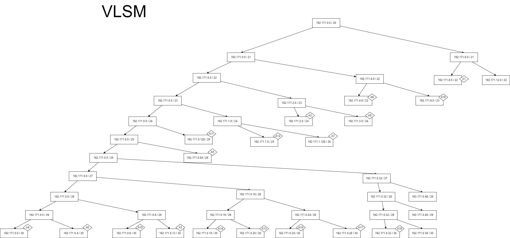

# Kelompok A05

- 5025201020 - Muhammad Ferdian Iqbal
- 5025201039 - Abd. Wahid
- 5025201197 - Abidjanna Zulfa Hamdika
  <br><br>

### SOAL



<hr>

## VLSM - CPT



### 1. Penghitungan



Setelah dilakukan penghitungan, dibuat pohon IP sebagai berikut



### Subnetting

Berikut adalah penyetelannya

#### The Beast

```
FastEthernet0 192.171.0.34 255.255.255.252
Default Gateway 192.171.0.33
```

#### The Order

```
FastEthernet0/0 192.171.0.10 255.255.255.252
FastEthernet0/1 192.171.0.65 255.255.255.192
FastEthernet1/0 192.171.0.5 255.255.255.252
FastEthernet1/1
```

#### The Minister

```
FastEthernet0/0 192.171.0.6 255.255.255.252
FastEthernet0/1 192.171.8.1 255.255.252.0
FastEthernet1/0 192.171.0.1 255.255.255.252
FastEthernet1/1
```

#### The DauntLess

```
FastEthernet0/0 192.171.0.2 255.255.255.252
FastEthernet0/1 192.171.2.1 255.255.255.0
```

#### The Intrument

```
FastEthernet0/0 192.171.0.14 255.255.255.252
FastEthernet0/1 192.171.0.129 255.255.255.128
FastEthernet1/0 192.171.0.17 255.255.255.252
FastEthernet1/1 192.171.0.25 255.255.255.252
```

#### The Firefist

```
FastEthernet0/0 192.171.0.18 255.255.255.252
FastEthernet0/1 192.171.3.1 255.255.255.0
FastEthernet1/0 192.171.4.1 255.255.254.0
FastEthernet1/1
```

#### The Resonance

```
FastEthernet0/0
FastEthernet0/1 192.171.0.29 255.255.255.252
Ethernet0/3/0 192.171.0.9 255.255.255.252
FastEthernet1/0 192.171.0.33 255.255.255.252
FastEthernet1/1 192.171.0.13 255.255.255.252
```

#### The Queen

```
FastEthernet0/0 192.171.3.2 255.255.255.0
FastEthernet0/1 192.171.0.21 255.255.255.252
```

#### The Profound

```
FastEthernet0/0 192.171.0.26 255.255.255.252
FastEthernet0/1 192.171.1.129 255.255.255.128
FastEthernet1/0 192.171.1.1 255.255.255.128
FastEthernet1/1
```

#### The Magical

```
FastEthernet0/0 192.171.0.30 255.255.255.252
FastEthernet0/1 192.171.6.1 255.255.254.0
FastEthernet1/0
FastEthernet1/1
```

#### Johan

```
FastEthernet0 192.171.2.2 255.255.255.0
Default Gateway 192.171.2.1
```

#### Phanora

```
FastEthernet0 192.171.2.3 255.255.255.0
Default Gateway 192.171.2.1
```

#### Guideau

```
FastEthernet0 192.171.8.2 255.255.252.0
Default Gateway 192.171.8.1
```

#### Ashaf

```
FastEthernet0 192.171.0.66 255.255.255.192
Default Gateway 192.171.0.65
```

#### The Witch

```
FastEthernet0 192.171.0.22 255.255.255.252
Default Gateway 192.171.0.21
```

#### Keith

```
FastEthernet0 192.171.3.3 255.255.255.0
Default Gateway 192.171.3.1
```

#### Oakleave

```
FastEthernet0 192.171.4.2 255.255.254.0
Default Gateway 192.171.4.1
```

#### Matt Cugat

```
FastEthernet0 192.171.0.130 255.255.255.128
Default Gateway 192.171.0.129
```

#### Helga

```
FastEthernet0 192.171.1.2 255.255.255.128
Default Gateway 192.171.1.1
```

#### Spendrow

```
FastEthernet0 192.171.1.130 255.255.255.128
Default Gateway 192.171.1.129
```

#### Corvekt

```
FastEthernet0 192.171.6.3 255.255.254.0
Default Gateway 192.171.6.1
```

#### Haines

```
FastEthernet0 192.171.6.2 255.255.254.0
Default Gateway 192.171.6.1
```

<hr>

#### The Resonance

```
ip route 10.0.6.0 255.255.254.0 10.0.0.30
ip route 10.0.3.0 255.255.255.0 10.0.0.14
ip route 10.0.0.20 255.255.255.252 10.0.0.14
ip route 10.0.0.128 255.255.255.128 10.0.0.14
ip route 10.0.4.0 255.255.254.0 10.0.0.14
ip route 10.0.0.16 255.255.255.252 10.0.0.14
ip route 10.0.0.24 255.255.255.252 10.0.0.14
ip route 10.0.1.128 255.255.255.128 10.0.0.14
ip route 10.0.1.0 255.255.255.128 10.0.0.14
ip route 10.0.0.64 255.255.255.192 10.0.0.10
ip route 10.0.8.0 255.255.252.0 10.0.0.10
ip route 10.0.2.0 255.255.255.0 10.0.0.10
ip route 10.0.0.0 255.255.255.252 10.0.0.10
ip route 10.0.0.4 255.255.255.252 10.0.0.10
```

#### The Minister

```
ip route 0.0.0.0 0.0.0.0 10.0.0.5
ip route 10.0.2.0 255.255.255.0 10.0.0.2
```

#### The Profound

```
ip route 0.0.0.0 0.0.0.0 10.0.0.25
```

#### The Magical

```
ip route 0.0.0.0 0.0.0.0 10.0.0.29
```

#### The DauntLess

```
ip route 0.0.0.0 0.0.0.0 10.0.0.1
```

#### The Intrument

```
ip route 0.0.0.0 0.0.0.0 10.0.0.13
ip route 10.0.3.0 255.255.255.0 10.0.0.18
ip route 10.0.0.20 255.255.255.252 10.0.0.18
ip route 10.0.4.0 255.255.254.0 10.0.0.18
ip route 10.0.0.16 255.255.255.252 10.0.0.18
ip route 10.0.0.24 255.255.255.252 10.0.0.26
ip route 10.0.1.128 255.255.255.128 10.0.0.26
ip route 10.0.1.0 255.255.255.128 10.0.0.26
```

#### The Order

```
ip route 0.0.0.0 0.0.0.0 10.0.0.9
ip route 10.0.8.0 255.255.252.0 10.0.0.6
ip route 10.0.2.0 255.255.255.0 10.0.0.6
ip route 10.0.0.0 255.255.255.252 10.0.0.6
ip route 10.0.0.4 255.255.254.252 10.0.0.6
```

#### The Firefist

```
ip route 0.0.0.0 0.0.0.0 10.0.0.17
ip route 10.0.0.20 255.255.255.252 10.0.3.2
```

#### The Queen

```
ip route 0.0.0.0 0.0.0.0 10.0.3.1
```

<hr>
